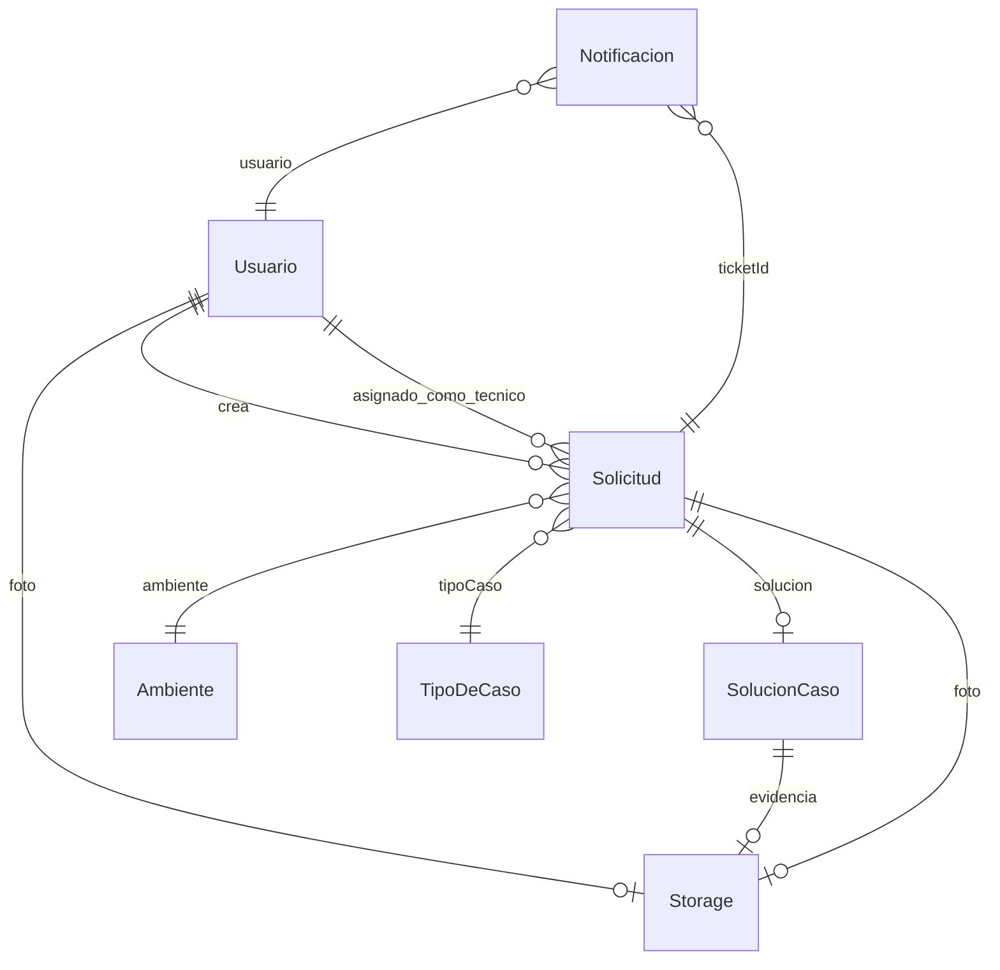

# Domain Model — MiAyudaTIC

> Modelos Mongoose en `server/src/features/**/models/` y `features/shared/models/`.

---

## Verificado

### Entidades

### Usuario

**Archivo:** `server/src/features/users/models/usuarios.ts`

| Campo | Tipo | Notas |
|-------|------|-------|
| nombre, correo, telefono, password | String | correo unique |
| rol | enum | funcionario \| lider \| tecnico |
| activo, estado | Boolean | tecnico nuevo: estado false |
| foto | ObjectId | → Storage |
| resetPasswordToken/Expires | String/Date | recovery |

### Solicitud (ticket)

**Archivo:** `server/src/features/tickets/models/solicitud.ts`

| Campo | Notas |
|-------|-------|
| codigoCaso | Consecutivo mensual |
| estado | solicitado \| asignado \| pendiente \| finalizado |
| descripcion, telefono, fecha | |
| usuario, ambiente, tipoCaso, tecnico, solucion, foto | refs |

### SolucionCaso

**Archivo:** `server/src/features/tickets/models/solucionCaso.ts`

- `descripcionSolucion`, `tipoSolucion` (pendiente \| finalizado)
- `evidencia` → Storage

### Soporte

- **TipoDeCaso** — catálogo tipos de soporte (líder administra).
- **Ambiente** — ambientes de formación.
- **Storage** — metadata URL archivo (Cloudinary o local).
- **Consecutivo** — secuencia por `yearMonth` para `codigoCaso`.
- **Notificacion** — mensaje in-app ligado a ticket.

### Reglas de negocio observadas

1. Solo funcionario crea solicitud (`routes/solicitud.ts` POST).
2. Solo tecnico registra solución (`routes/solucionCaso.ts`).
3. Técnico debe estar aprobado (`accountStatus.ts`).
4. Líder no se auto-registra (`validators/auth.ts`).

---

## Inferido

- Estados `solicitado` vs `pendiente` usados en distintos puntos del flujo; semántica exacta por transición en controllers.

---

## Riesgos / Deuda

- Tipos TS duplicados en `client/src/shared/types/domain.ts`.
- Notificacion fuera de `core/models.ts` registry.

---

## Preguntas abiertas

- ¿TTL/archivado de solicitudes finalizadas?

---

## Matriz de confianza

| Modelo | Nivel |
|--------|-------|
| Schemas Mongoose | verified |
| Transiciones estado | partial |
