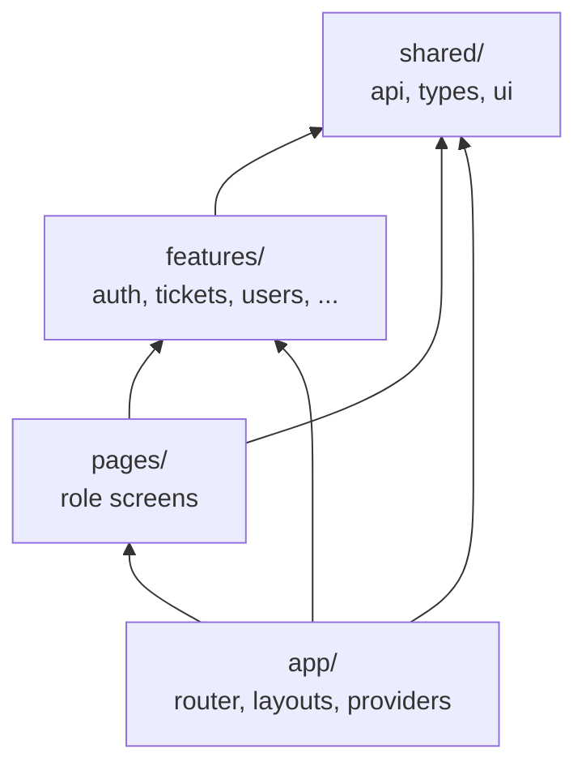

# Frontend Architecture — MiAyudaTIC Web

> React SPA en `client/src/`. Deploy: Vercel.

---

## Verificado

### Capas FSD-lite

**Prohibido:** cross-import entre features; page importa otra page.

### Bootstrap

`main.tsx` → `App.tsx` → `BrowserRouter` + `AuthProvider` + `Allroutes.tsx` + ToastContainer.

### Routing

- **Guest routes:** login, register, forgot, reset — redirect si autenticado.
- **Private routes:** requieren sesión cookie.
- **RequireRole:** redirige a home del rol si mismatch.

**Home por rol:** `app/router/roleHome.ts`.

### State

- Auth global: React Context (`features/auth/context/AuthContext.tsx`).
- Formularios: react-hook-form local.
- Notificaciones: hook `useNotificaciones` poll 30s.

### API client

`shared/api/axios.ts`:
- Base URL desde `VITE_BACKEND_URL` / `VITE_API_URL` + `/api`.
- `withCredentials: true`.
- 401 handler → logout.

### Layouts

| Layout | Uso |
|--------|-----|
| AppLayout | Header NavApp |
| AdminLayout | Sidebar líder |
| TecnicoLayout | Sidebar técnico |
| AdminSolicitudLayout, AdminTecnicosLayout | Sub-nav admin |

### Feature modules

| Feature | API | UI |
|---------|-----|-----|
| auth | auth.service.ts | LoginForm, RegisterForm, ... |
| tickets | solicitud, solucion | ResolutionModal, NavTecnico |
| users | tecnicos.service | NavAdmin, Profile |
| ambientes | ambiente.service | — |
| estadisticas | estadisticas.service | charts en AdminEstadisticas |
| notifications | notifications.service | NavApp bell |

---

## Inferido

- No hay code-splitting por rol documentado; Vite default chunks.

---

## Riesgos / Deuda

- Sin `@miayuda/contracts` — drift tipos.
- Socket no usado en web.
- Tests mínimos.

---

## Preguntas abiertas

- ¿Migrar notificaciones a Socket.IO?

---

## Matriz de confianza

| Área | Nivel |
|------|-------|
| FSD structure | verified |
| Auth flow | verified |
| Realtime | verified absent |
