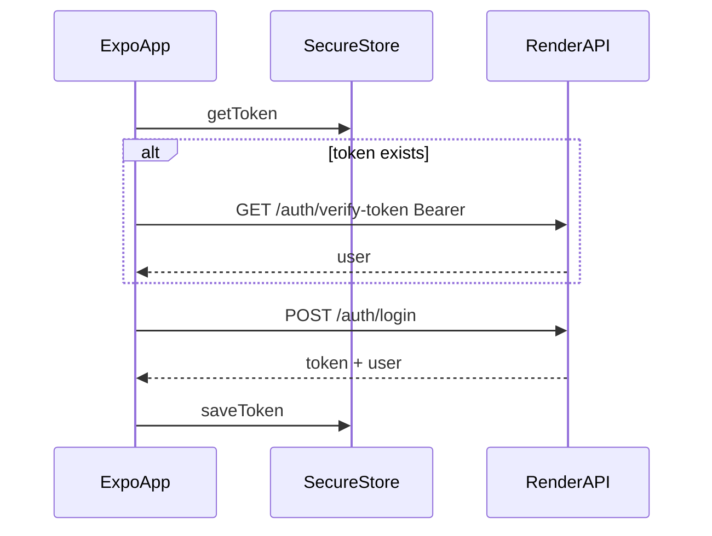

# Mobile Architecture — MiAyudaTIC

> **Oficial:** `mobile/MiAyudaTIC-Mobile` (Expo).  
> **Legacy:** `mobile_flutter/MBO_ULT` (referencia, no integrar).

---

## Verificado — Expo (oficial)

### Stack y navegación

- **expo-router** file-based: `app/` directory.
- Entry: `expo-router/entry` (`package.json`).
- Auth wrapper: `AuthProvider` en `app/_layout.tsx`.
- Path alias `@/*` → `src/*`.

### Arquitectura de carpetas

```
app/           # Rutas (UI screens)
src/
  features/    # Dominio (solo auth hoy)
  shared/      # api, storage, theme, ui
```

Patrón objetivo: alinear con web FSD — nuevas features bajo `src/features/<name>/`.

### Flujo auth



**Archivos:** `auth-context.tsx`, `api.ts`, `token.ts`, `client.ts`.

### Roles

| Rol | Mobile |
|-----|--------|
| funcionario | Full auth → session stub |
| tecnico | Register + pending → session tras aprobación |
| lider | **Bloqueado** — `lider-not-supported.tsx` |

### Config

- `EXPO_PUBLIC_API_URL` — sin trailing slash; client añade `/api`.
- Prod default: `https://miayudatics-v1-0.onrender.com`.

### Pendiente (código no existe aún)

- Solicitudes, ambientes, tipoCaso, soluciones.
- Socket.IO (`auth.token` + `@miayuda/contracts` events).
- Notificaciones push (no FCM configurado).

**Referencia implementación:** Flutter legacy screens + web `features/tickets`.

---

## Verificado — Flutter (LEGACY)

| Aspecto | Detalle |
|---------|---------|
| Ruta | `mobile_flutter/MBO_ULT/` |
| Estado | Congelado / prototipo |
| Backend | `backendnodeproyectomesaservicio.onrender.com` — **no usar** |
| Valor | Referencia UX flujos campo (funcionario/técnico) |
| Git | `.git` anidado — no mezclar historial |

**No añadir features aquí.** Portar a Expo si se necesita paridad.

---

## Inferido

- Roadmap mobile v1 = auth + solicitud funcionario + casos técnico.
- Líder permanece web-only por diseño institucional.

---

## Riesgos / Deuda

1. Session stub sin navegación post-login útil.
2. Assets PNG faltantes en repo.
3. Fuera de pnpm workspace — version drift deps.
4. Sin EAS/CI.
5. Flutter confunde onboarding.

---

## Preguntas abiertas

- ¿Expo dev client vs Expo Go para equipo?
- ¿Push notifications en v2?

---

## Matriz de confianza

| Componente | Nivel |
|------------|-------|
| Expo auth arch | verified |
| Expo business modules | verified absent |
| Flutter legacy | verified |
| EAS deploy | uncertain |
