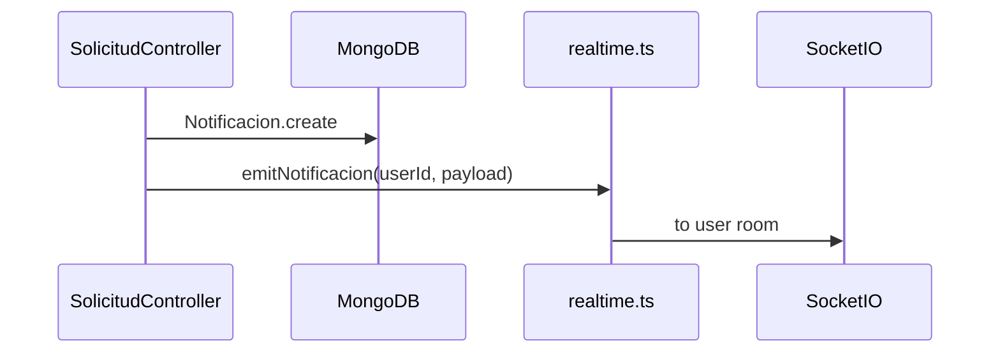

# Notifications & Events — MiAyudaTIC

---

## Verificado

### Canales

| Canal | Implementación | Clientes |
|-------|----------------|----------|
| Email | Brevo REST (+ SMTP fallback) | Todos (transaccional) |
| In-app DB | Modelo `Notificacion` | API GET /notificaciones |
| Socket.IO | `nuevaNotificacion` event | Capable — web no consume; mobile pendiente |

### Email templates

`server/src/shared/emails/templates/`:
- passwordReset
- solicitudRegistrada
- casoAsignado
- casoCerrado
- tecnicoAprobado
- tecnicoDenegado

**Trigger points:** controllers auth, solicitud, solucionCaso, tecnicos.

### Notificaciones in-app

**Modelo:** `features/shared/models/notificaciones.ts`
- `tipo`: `estado_ticket` (único valor)
- `leido`: boolean
- Scoped por `usuario`

**API:**
- GET `/notificaciones` — no leídas del usuario actual
- PATCH `/notificaciones/:id/leer`
- PATCH `/notificaciones/leer-todas`

### Realtime flow

**Rooms:** `user:{userId}` — join on socket connect (`handleSocket.ts`).

### Eventos de dominio (socket)

| Evento | Cuándo |
|--------|--------|
| actualizarSolicitud | Cambio estado solicitud |
| actualizarTecnico | Asignación caso |
| nuevaNotificacion | Nueva notificación persistida |
| connection:ack | Conexión exitosa |

**Tipos:** `@miayuda/contracts` RealtimeEvents.

### Web client behavior

`client/src/features/notifications/hooks/useNotificaciones.ts` — **poll HTTP cada 30s**, no socket.

### Mobile

- Expo: sin notificaciones implementadas.
- Push FCM/APNs: no configurado.

---

## Inferido

- Email es canal principal de awareness para usuarios fuera de la app.
- Socket preparado para mobile v2 y eventual web upgrade.

---

## Riesgos / Deuda

1. Web polling — latencia y carga vs push/socket.
2. Sin push mobile nativo.
3. Un solo `tipo` notificación — extensibilidad limitada.

---

## Preguntas abiertas

- ¿Unificar web en Socket.IO?
- ¿Expo Notifications en roadmap?

---

## Matriz de confianza

| Canal | Nivel |
|-------|-------|
| Email | verified |
| DB notifications | verified |
| Socket server | verified |
| Socket clients | partial |
