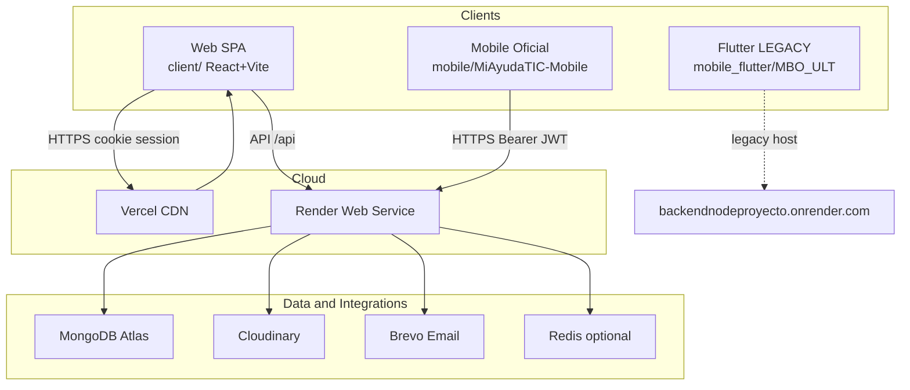

# System Overview — MiAyudaTIC

> Mesa de ayuda institucional SENA (CTPI-Cauca). Plataforma web + API + mobile (Expo).

---

## Verificado

### Topología

### Aplicaciones

| App | Ruta | Usuarios | Transporte auth |
|-----|------|----------|-----------------|
| Web | `client/` | funcionario, tecnico, lider | httpOnly cookie |
| API | `server/` | todos los clientes | cookie + Bearer |
| Mobile Expo | `mobile/MiAyudaTIC-Mobile/` | funcionario, tecnico (lider bloqueado) | Bearer + SecureStore |
| Contracts | `packages/contracts/` | server (runtime) | — |

### Flujos principales (alto nivel)

1. **Funcionario** crea solicitud (+ foto opcional) → notificación/email → líder asigna técnico → técnico resuelve → cierre + email.
2. **Técnico** se registra → líder aprueba → acceso a casos asignados.
3. **Líder** administra usuarios, ambientes, tipos de caso, métricas.

### Dependencias externas

| Servicio | Uso | Config |
|----------|-----|--------|
| MongoDB Atlas | Persistencia | `DB_URI` |
| Cloudinary | Media prod | `CLOUDINARY_*` |
| Brevo | Email transaccional | `BREVO_API_KEY` |
| Redis | Socket.IO scale | `REDIS_URL` optional |

**Evidencia:** `server/.env.example`, `audit/backend-audit.md`.

---

## Inferido

- Web no usa Socket.IO hoy; notificaciones por polling HTTP.
- Mobile Expo implementará sockets al extender más allá de auth.

---

## Riesgos / Deuda

- Flutter legacy con backend incorrecto.
- Mobile fuera de pnpm workspace.
- Sin observabilidad centralizada (APM).

---

## Preguntas abiertas

- ¿Multi-instancia Render con Redis en prod?

---

## Matriz de confianza

| Componente | Nivel |
|------------|-------|
| Topología web+API | verified |
| Mobile Expo auth | verified |
| Flutter legacy | verified |
| Redis prod | uncertain |
