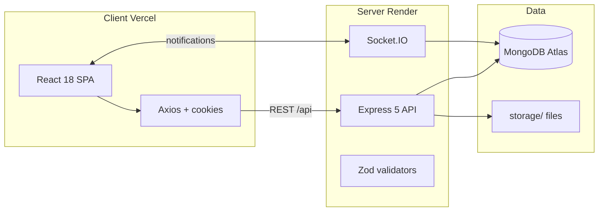

# Brief Técnico — MiAyudaTIC v1.0

Monorepo full-stack MERN para mesa de ayuda institucional. Este documento permite a un desarrollador o LLM entender arquitectura, stack y estado de migración sin leer todo el código.

---

## Quick path

1. Clonar `MiAyudaTics_v1.0`, instalar con `pnpm install` en la raíz.
2. Configurar `server/.env` y `client/.env` (ver tabla de variables).
3. `pnpm -C server run dev` (puerto 8000) + `pnpm -C client run dev` (Vite).
4. Verificar: login → crear solicitud → asignar → resolver.

---

## Arquitectura de alto nivel



---

## Estructura del monorepo

```
MiAyudaTics_v1.0/
├── client/          # React + Vite (frontend)
├── server/          # Express + TypeScript (backend)
├── docs/            # Contrato arquitectónico, agentic-os, deployment
├── openspec/        # Specs de migración (fases 1–3)
├── package.json     # Husky, commitlint
└── pnpm-workspace.yaml
```

**Regla mandatoria:** `client` y `server` no se importan entre sí. Solo pnpm en la raíz (contrato en `docs/ARCHITECTURE.md`).

---

## Stack tecnológico

| Capa | Tecnologías |
|------|-------------|
| Frontend | React 18, Vite 8, React Router 6, Tailwind 3, Axios, Chart.js, Vitest |
| Backend | Node ≥20, Express 5, TypeScript strict, Mongoose 8, Zod 4, Socket.IO 4 |
| Auth | JWT (`jsonwebtoken`), bcryptjs, cookies, rate-limit en reset password |
| Email | Nodemailer / Brevo |
| Archivos | Multer, carpeta `storage/`, pdf-lib |
| Calidad | ESLint, Prettier, Husky (tsc + eslint pre-commit), Commitlint |

---

## Backend — organización

```
server/src/
├── index.ts              # Bootstrap HTTP + MongoDB
├── core/
│   ├── app.ts            # Express, CORS, static, /api
│   ├── routes.ts         # Registro de rutas
│   └── models.ts         # Registry Mongoose
├── features/
│   ├── auth/             # login, register, password recovery
│   ├── users/            # usuarios, técnicos
│   ├── tickets/          # solicitud, solución, tipos, gráficas
│   └── shared/           # ambientes, notificaciones, storage
└── shared/
    ├── middleware/       # session, rol, validators
    ├── validators/       # Zod schemas
    ├── types/dto.ts      # DTOs exportables
    └── utils/            # JWT, email, socket, storage
```

Patrón por feature: `routes` → `controllers` → `models` (+ validators en `shared/validators`).

---

## Frontend — organización (estado actual)

**Objetivo (FSD-lite):** `app → pages → features → shared`

**Realidad:** migración en progreso. Código activo en carpetas legacy:

| Carpeta | Rol | Estado |
|---------|-----|--------|
| `app/` | Router, AuthContext | Activo |
| `pages/` | Vistas por rol | Activo (JSX) |
| `components/`, `layouts/` | UI y shells | Legacy, en uso |
| `services/` | Clientes Axios | Legacy, en uso |
| `features/` | Dominio | Solo README + scaffold |

~46 archivos `.jsx` + 10 `.js` vs 2 `.ts/.tsx` en `client/src`.

---

## Modelo de datos (Mongoose)

| Modelo | Propósito |
|--------|-----------|
| `usuarios` | Cuentas con rol (`funcionario`, `tecnico`, `lider`), `activo`, `estado` (aprobación técnico) |
| `solicitud` | Ticket: usuario, ambiente, tipoCaso, técnico, estado, codigoCaso |
| `solucionCaso` | Resolución vinculada a solicitud |
| `tipoCaso` | Catálogo (Hardware, Software, etc.) |
| `consecutivoCaso` | Secuencia mensual para códigos |
| `ambienteFormacion` | Espacios de formación |
| `notificaciones` | Alertas por usuario |
| `storage` | Metadatos de archivos subidos |

---

## Autenticación y autorización

| Aspecto | Implementación |
|---------|----------------|
| Login | JWT firmado, cookie `token` + JSON con token en respuesta |
| Verificación | `GET /api/auth/verify-token` |
| Middleware | `authMiddleware` (JWT cookie o Bearer), `checkRol([...])` |
| Reset password | Token SHA-256 en BD; rate limit en restablecimiento |
| Socket.IO | Sin autenticación en handshake (deuda — ver code review) |

---

## Variables de entorno

### Server (mínimo operativo)

| Variable | Uso |
|----------|-----|
| `PORT` | Puerto HTTP (default 8000) |
| `DB_URI` | MongoDB connection string |
| `JWT_SECRET` | Firma JWT (**no debe usar fallback `'secret'`**) |
| `CLIENT_URL` | Link en email de recuperación |
| `PUBLIC_URL` / `RENDER_URL` | URLs públicas para assets |
| `BREVO_USER`, `BREVO_PASSWORD`, `EMAIL_FROM` | Email transaccional |
| `EMAIL`, `EMAIL_PASSWORD` | Alternativas legacy en algunos controladores |

### Client

| Variable | Uso en código |
|----------|---------------|
| `VITE_BACKEND_URL` | Base URL API en `axios.js` |

**Discrepancia:** `docs/ARCHITECTURE.md` documenta `VITE_API_URL`; el código usa `VITE_BACKEND_URL`.

---

## Despliegue (política documentada)

| Componente | Plataforma | Build | Start |
|------------|------------|-------|-------|
| Frontend | Vercel | `pnpm run build` en `client/` | estático `dist/` |
| Backend | Render | `pnpm install && pnpm build` en `server/` | `pnpm run start` → `node dist/index.js` |
| DB | MongoDB Atlas | — | — |

**Problemas actuales de deploy:**

- `pnpm -C server build` falla (error TS `solicitud.ts:80`).
- CORS en `app.ts` apunta a URL Render del frontend, no Vercel.
- `server/Dockerfile` desactualizado (npm, puerto 3000, `npm run dev`).

---

## Testing

| Suite | Runner | Estado |
|-------|--------|--------|
| Unit/smoke (server) | Vitest + Supertest + mocks | 10 tests OK |
| Integración | `production-simulation.test.ts` | Falla sin `.env.test` |
| Client | `example.test.tsx` | Scaffold |

Openspec menciona Jest; el runner real es **Vitest**.

---

## Migración y fases (openspec)

| Fase | Contenido | Estado |
|------|-----------|--------|
| 1 | pnpm, Husky, TS strict, ESLint | Completada |
| 2 | Backend JS → TS | Completada |
| 2.5 | express-validator → Zod | Completada |
| 3a | Deploy-confidence tests | Completada (10 unit) |
| 3b | Frontend JS → TS + FSD | **Pendiente** |
| 4 (implícita) | Service layer, `@miayuda/types`, tests frontend | Sin spec |

---

## Baseline de calidad (12-jun-2026)

```
Server build:  FAIL (TS2322 solicitud.ts:80)
Server test:   10 pass, 5 skip, 1 suite fail
Client build:  OK
Client lint:   13 warnings
Server lint:   103 warnings
```

---

## Decisiones técnicas (ADRs resumidos)

| ID | Decisión |
|----|----------|
| ADR-001 | TypeScript strict; `allowJs` temporal en client |
| ADR-002 | Zod para contratos runtime API |
| ADR-003 | Arquitectura por features |
| ADR-004 | Vitest (no Jest activo) + mocks lean; Playwright E2E no iniciado |
| ADR-005 | pnpm exclusivo |

Fuente: `openspec/archive/DECISIONS_HISTORY.md`

---

## Siguiente paso

- Endpoints: [04-superficie-api.md](./04-superficie-api.md)
- Flujos: [03-flujos-usuario.md](./03-flujos-usuario.md)
- Hallazgos: [06-code-review.md](./06-code-review.md)
