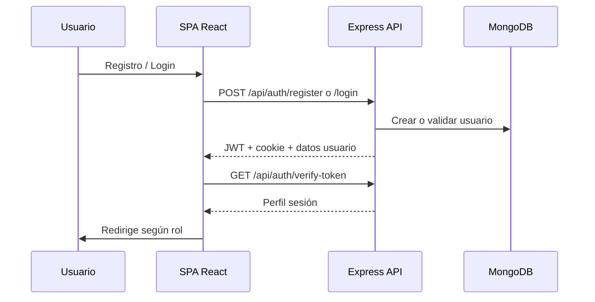
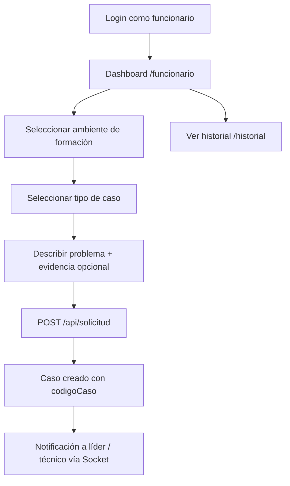
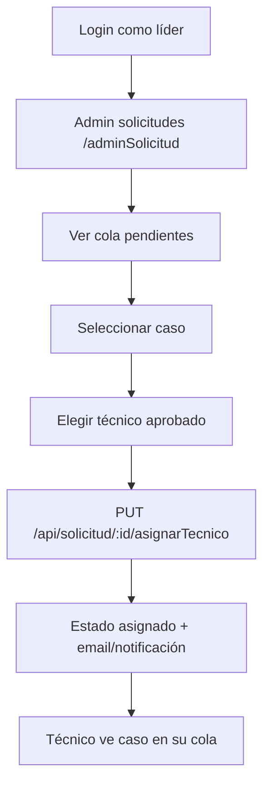
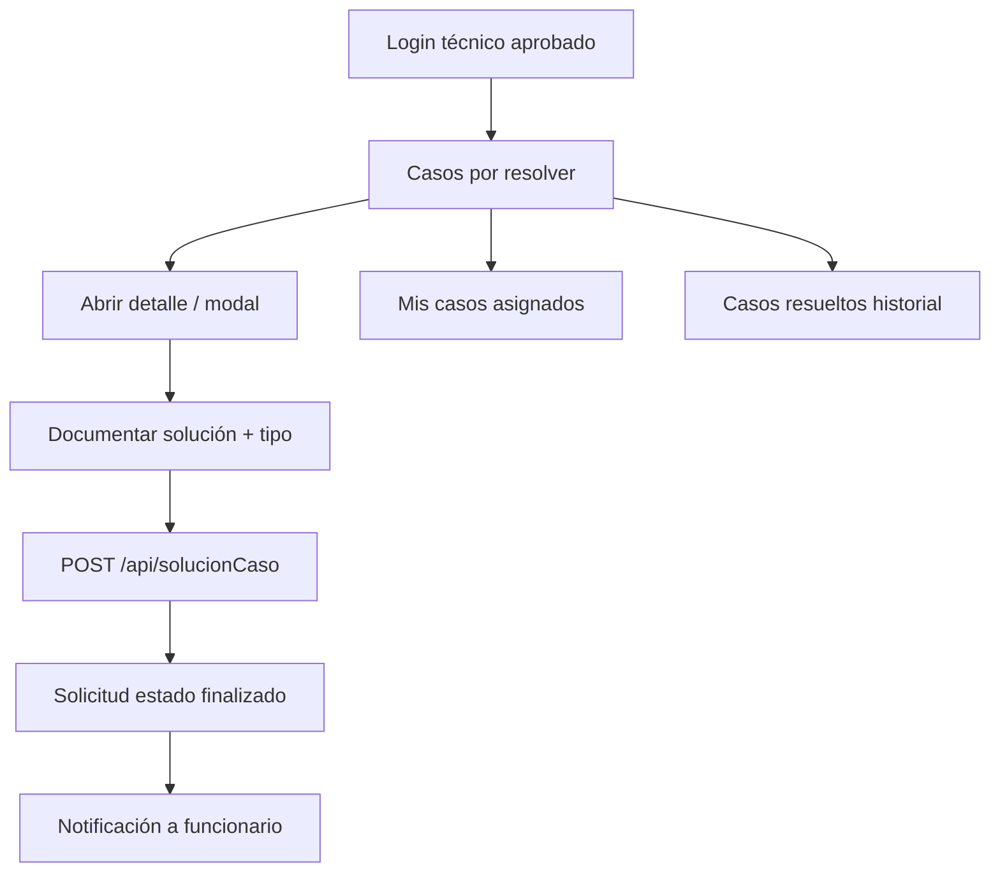
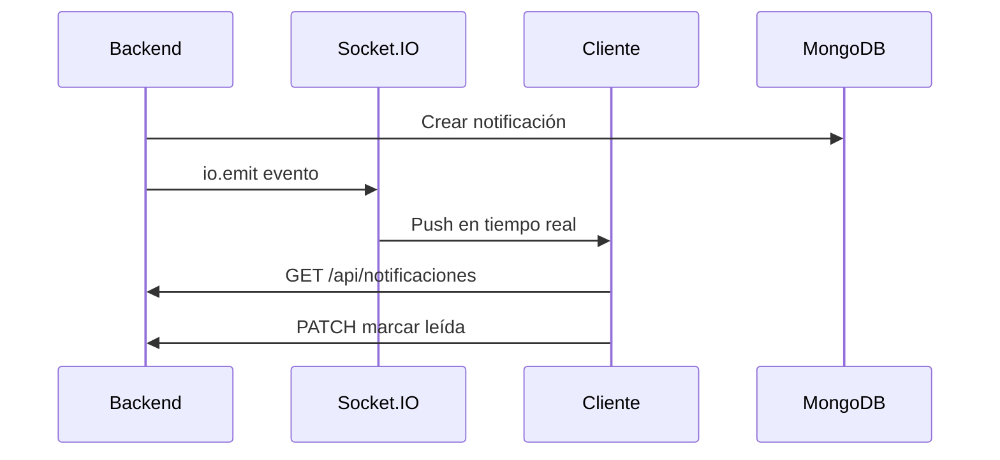
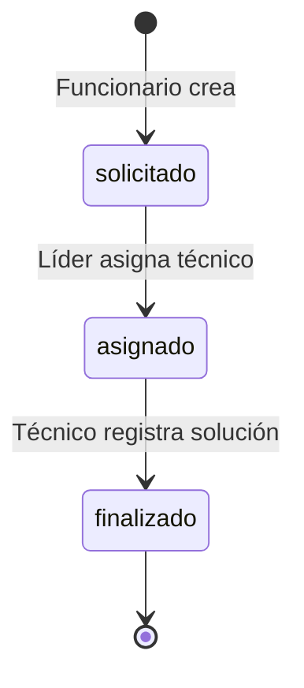

# Flujos de Usuario — MiAyudaTIC

Journey maps por rol. Cada flujo describe la experiencia esperada en v1.0.

---

## Mapa de roles y rutas

| Rol | Rutas principales (frontend) |
|-----|------------------------------|
| Funcionario | `/funcionario`, `/perfil` |
| Técnico | `/casos-por-resolver`, `/mis-casos`, `/casos-resueltos`, `/perfil` |
| Líder TIC | `/adminSolicitud`, `/adminTecnicos`, `/adminAmbientes`, `/adminCasos`, `/adminEstadisticas`, `/seguimiento`, `/tecnicosActivos`, `/tecnicosInactivos`, `/perfil` |

**Nota de seguridad:** hoy cualquier usuario autenticado puede *navegar* a rutas de otro rol; la API restringe mutaciones. Ver [06-code-review.md](./06-code-review.md).

---

## Flujo 0 — Onboarding y autenticación

| Paso | Funcionario | Técnico | Líder |
|------|-------------|---------|-------|
| Registro | Sí (rol funcionario) | Sí (queda pendiente `estado: false`) | No debería ser público* |
| Login | Inmediato | Solo si `estado: true` | Inmediato |
| Recuperar clave | Email con token | Igual | Igual |

\*Hallazgo de seguridad: registro público permite `rol: lider` si no existe uno.

---

## Flujo 1 — Funcionario: reportar un caso

**Estados del caso:** `solicitado` (inicial) → luego `asignado` → `finalizado`.

**Datos capturados:** ambiente, tipoCaso, descripción, usuario (sesión), archivo opcional vía storage.

---

## Flujo 2 — Líder TIC: asignar técnico

**Acciones paralelas del líder:**

- Aprobar/denegar técnicos pendientes (`/adminTecnicos`).
- Gestionar ambientes (`/adminAmbientes`).
- Gestionar tipos de caso (`/adminCasos`).
- Ver estadísticas (`/adminEstadisticas`).
- Seguimiento global (`/seguimiento`).

---

## Flujo 3 — Técnico: resolver caso

**Bug conocido:** en `CasosPorResolverTabla.jsx` el payload puede enviar `_id` de solicitud como `tipoCaso` — ver code review.

---

## Flujo 4 — Notificaciones

El navbar muestra campana con notificaciones no leídas.

---

## Flujo 5 — Estadísticas (líder)

| Vista | Endpoint | Datos |
|-------|----------|-------|
| Por mes | `GET /api/graficaSolicitudesPorMes?year=` | Volumen temporal |
| Por ambiente | `GET /api/graficaSolicitudesPorAmbiente` | Distribución por espacio |

**Nota:** ambos endpoints están **sin autenticación** en el backend actual — riesgo de fuga de métricas.

---

## Matriz rol × capacidad

| Capacidad | Funcionario | Técnico | Líder |
|-----------|:-----------:|:-------:|:-----:|
| Crear solicitud | ✓ | — | — |
| Ver propias solicitudes | ✓ | — | ✓ (todas) |
| Asignar técnico | — | — | ✓ |
| Resolver caso | — | ✓ | — |
| Aprobar técnicos | — | — | ✓ |
| CRUD ambientes | — | — | ✓ |
| CRUD tipos caso | — | — | ✓ |
| Estadísticas | — | — | ✓ |
| Editar perfil propio | ✓ | ✓ | ✓ |

---

## Estados del ticket (ciclo de vida)

---

## Puntos de fricción UX documentados

1. Sin loading/error states en varias tablas funcionario/técnico.
2. Evidencia en modal de resolución no se envía al backend.
3. `MisCasosTabla` usa URL hardcodeada `localhost:3010` — falla fuera de dev.
4. Perfil muestra Mongo `_id` al usuario.

---

## Siguiente paso

[04-superficie-api.md](./04-superficie-api.md) para detalle de endpoints por flujo.
