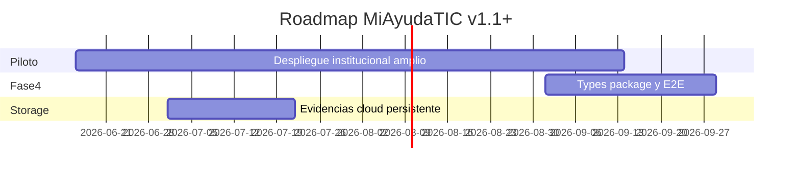

# Deuda Técnica y Roadmap — MiAyudaTIC

Consolidación de `openspec/`, `docs/ARCHITECTURE.md` y hallazgos del [code review](./06-code-review.md).

**Actualizado:** junio 2026 — post-hardening MVP institucional (oleadas 1–4).

---

## Quick path — prioridades

1. ~~**P0 seguridad + build**~~ ✅ Completado (oleada 1–2)
2. ~~**P1 estabilidad y RBAC completo**~~ ✅ Completado (oleada 1–3)
3. **Fase 3 openspec** — frontend TypeScript + FSD — **mayormente completada** en código; specs pendientes de actualizar
4. **Fase 4** — services, types compartidos, tests E2E (por especificar)

---

## Estado de fases openspec

| Fase | Spec | Estado real | Notas |
|------|------|-------------|-------|
| 1 | `phase-1-quality-setup.md` | ✅ Completada | pnpm, Husky, TS backend scaffold |
| 2 | `phase-2-backend-migration.md` | ✅ Completada | Spec file stale (“En progreso”) |
| 2.5 | `phase-2.5-zod-migration.md` | ✅ Completada | 100% Zod en validators definidos |
| 3a | Deploy confidence tests | ✅ Completada | Vitest server (25+ tests seguridad/contrato) |
| 3b | `phase-3-frontend-migration.md` | ✅ Completada en código | Client 100% TSX; FSD-lite en `features/` |
| 4 | — | ❌ Sin spec | Mencionada en deuda: services, `@miayuda/types` |

### Discrepancias openspec vs código

| Tema | openspec dice | Realidad |
|------|---------------|----------|
| Test runner | Jest (config.yaml) | Vitest |
| Backend paths | `controllers/`, `routes/` flat | `features/` + `core/` + `shared/` |
| Frontend tests | None | Vitest + Testing Library (helpers, RequireRole) |
| E2E | Playwright (ADR-004) | No implementado |
| Fase 3 | Solo frontend TS | Completada; hardening MVP ene–jun 2026 |

---

## Deuda P0 — Bloqueantes ✅ CERRADA

| # | Item | Estado |
|---|------|--------|
| 1 | Fix TS build `solicitud.ts:80` | ✅ |
| 2 | Auth en rutas API expuestas | ✅ |
| 3 | Cerrar registro líder + mass assignment | ✅ |
| 4 | Middleware estado/activo | ✅ |
| 5 | JWT_SECRET fail-fast; httpOnly cookie | ✅ |
| 6 | CORS alineado con Vercel | ✅ |

---

## Deuda P1 — Alto impacto ✅ CERRADA

| # | Item | Estado |
|---|------|--------|
| 7 | RequireRole en frontend | ✅ |
| 8 | Zod en todos los POST/PUT | ✅ (validators definidos) |
| 9 | Socket.IO auth + rooms | ✅ |
| 10 | Storage: auth + multer hardening | ✅ |
| 11 | IDOR notificaciones y soluciones | ✅ |
| 12 | Consecutivo atómico | ✅ |
| 13 | Rate limits login/register/forgot | ✅ |
| 14 | Revocación JWT en logout/reset | Parcial — cookie httpOnly; sin denylist |
| 15 | `.env.test` + separar integration en vitest | ✅ |
| 16 | Dockerfile | ✅ Multi-stage producción |
| 17 | Bug `MisCasosTabla` localhost | Verificar en QA |
| 18 | Bug `tipoCaso` payload resolución | ✅ |

---

## Deuda P2 — Mejora continua

| Área | Items |
|------|-------|
| Lint | Reducir warnings client+server |
| Storage cloud | GridFS/S3 para evidencias persistentes en Render |
| Tipos | Reducir `any` residual en session/JWT |
| Docs | Actualizar specs openspec phase-2/3 |
| E2E | Playwright smoke (login, ticket, asignar, cerrar) |
| UI | Evidencia en modal; más páginas legacy al design system |

---

## Hardening MVP (jun 2026) — entregables

| Oleada | Entregable |
|--------|------------|
| 1 Trust | API cerrada, auth hardening, IDOR, rate limits, tests seguridad |
| 2 Reliability | Build CI, health, env validation, storage unificado, vercel.json |
| 3 Polish | 401 global, loading/error en páginas core, 404, mobile nav, a11y mínimo |
| 4 Institutional | README, SECURITY, RUNBOOK, DATA-HANDLING, pilot playbook, Socket auth |

Documentación operativa: `docs/SECURITY.md`, `docs/RUNBOOK.md`, `docs/DATA-HANDLING.md`, `briefs/08-pilot-playbook.md`.

---

## Roadmap propuesto (post-MVP)

### Próximo sprint — post-piloto

- [ ] Storage cloud (GridFS/S3) para evidencias en Render
- [ ] Playwright E2E críticos
- [ ] `@miayuda/types` workspace package
- [ ] OpenAPI o contrato API versionado

---

## Métricas de salida

| Fase | Criterio | Estado |
|------|----------|--------|
| P0 | `pnpm build` OK; 0 rutas PII públicas | ✅ |
| P1 | RequireRole; Zod writes; Socket autenticado | ✅ |
| Fase 3 | 100% `.tsx` en `client/src` | ✅ |
| MVP institucional | CI verde, docs ops, health check | ✅ |

---

## Siguiente paso

Ejecutar [pilot playbook](./08-pilot-playbook.md) con despliegue controlado. Detalle histórico de hallazgos: [06-code-review.md](./06-code-review.md).
