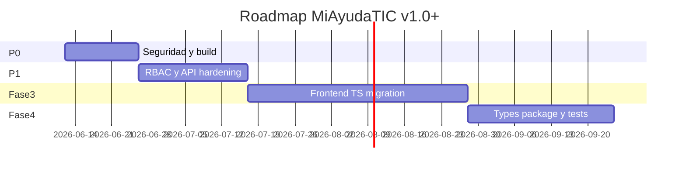

# Deuda Técnica y Roadmap — MiAyudaTIC

Consolidación de `openspec/`, `docs/ARCHITECTURE.md` y hallazgos del [code review](./06-code-review.md).

---

## Quick path — prioridades

1. **P0 seguridad + build** (1–2 semanas)
2. **P1 estabilidad y RBAC completo** (2–4 semanas)
3. **Fase 3 openspec** — frontend TypeScript + FSD (4–8 semanas)
4. **Fase 4** — services, types compartidos, tests E2E (por especificar)

---

## Estado de fases openspec

| Fase | Spec | Estado real | Notas |
|------|------|-------------|-------|
| 1 | `phase-1-quality-setup.md` | ✅ Completada | pnpm, Husky, TS backend scaffold |
| 2 | `phase-2-backend-migration.md` | ✅ Completada | Spec file stale (“En progreso”) |
| 2.5 | `phase-2.5-zod-migration.md` | ✅ Completada | 100% Zod en validators definidos |
| 3a | Deploy confidence tests | ✅ Completada | 10 tests Vitest; no en config.yaml |
| 3b | `phase-3-frontend-migration.md` | 🔜 Pendiente | 56 JSX, 2 TSX |
| 4 | — | ❌ Sin spec | Mencionada en deuda: services, `@miayuda/types` |

### Discrepancias openspec vs código

| Tema | openspec dice | Realidad |
|------|---------------|----------|
| Test runner | Jest (config.yaml) | Vitest |
| Backend paths | `controllers/`, `routes/` flat | `features/` + `core/` + `shared/` |
| Frontend tests | None | Vitest scaffold |
| E2E | Playwright (ADR-004) | No implementado |
| Fase 3 | Solo frontend TS | Tests deploy nombrados “Fase 3” en PROGRESS_HISTORY |

---

## Deuda P0 — Bloqueantes

| # | Item | Origen | Esfuerzo est. |
|---|------|--------|---------------|
| 1 | Fix TS build `solicitud.ts:80` | Slice 8 | S |
| 2 | Auth en rutas API expuestas | Slices 2–4 | M |
| 3 | Cerrar registro líder + mass assignment | Slice 1 | S |
| 4 | Middleware estado/activo | Slice 1 | S |
| 5 | JWT_SECRET fail-fast; httpOnly cookie | Slice 1 | S |
| 6 | CORS alineado con Vercel | Slice 8 | S |

---

## Deuda P1 — Alto impacto

| # | Item | Origen |
|---|------|--------|
| 7 | RequireRole en frontend | Slices 5–6 |
| 8 | Zod en todos los POST/PUT | Slices 2–4 |
| 9 | Socket.IO auth + rooms | Slice 4 |
| 10 | Storage: auth + multer hardening | Slice 4 |
| 11 | IDOR notificaciones y soluciones | Slices 2, 4 |
| 12 | Consecutivo atómico | Slice 2 |
| 13 | Rate limits login/register/forgot | Slice 1 |
| 14 | Revocación JWT en logout/reset | Slice 1 |
| 15 | `.env.test` + separar integration en vitest | Slice 8 |
| 16 | Dockerfile o eliminarlo | Slice 8 |
| 17 | Bug `MisCasosTabla` localhost | Slice 6 |
| 18 | Bug `tipoCaso` payload resolución | Slice 6 |

---

## Deuda P2 — Mejora continua

| Área | Items |
|------|-------|
| Lint | 116 warnings client+server; política zero-warnings |
| Errores | `catch (_error)` sin log en ~30 controladores |
| Tipos | `any` en session, JWT, notificaciones |
| Docs | Encoding mojibake en specs 2.5; actualizar phase-2 |
| Lockfiles | `client/pnpm-lock.yaml` y `server/pnpm-lock.yaml` extra |
| CI/CD | Sin GitHub Actions; sin `render.yaml`/`vercel.json` en repo |
| Email | Fragmentación EMAIL vs BREVO vs EMAIL_USER |
| Tests | Validator unit tests (diferido 2.5); frontend tests (Fase 4) |
| UI | Evidencia en modal no enviada; loading states |

---

## Roadmap propuesto (trimestre)

### Sprint 0 — “Ship safe” (P0)

- [ ] Build verde en server
- [ ] Rutas sensibles con auth
- [ ] Register/login endurecido
- [ ] CORS por env

### Sprint 1 — “Defense in depth” (P1)

- [ ] Guards de rol en React
- [ ] Zod completo + no mass assignment
- [ ] Socket auth
- [ ] Storage seguro

### Sprint 2–4 — Fase 3 openspec

- [ ] Migrar `main.jsx`, `App.jsx` → TSX
- [ ] Mover dominios a `features/` (auth, tickets, users)
- [ ] Poblar `shared/` con UI kit
- [ ] `allowJs: false`

### Sprint 5+ — Fase 4 (a especificar en openspec)

- [ ] `@miayuda/types` workspace package
- [ ] Controller → service extraction
- [ ] Playwright E2E críticos (login, crear caso, asignar, resolver)
- [ ] OpenAPI o contrato API versionado

---

## Métricas de salida por fase

| Fase | Criterio de done |
|------|------------------|
| P0 | `pnpm build` OK ambos; 0 rutas PII públicas; auth review re-judged APPROVED |
| P1 | RequireRole en todas las rutas privadas; Zod en writes; Socket autenticado |
| Fase 3 | 100% `.tsx` en `client/src`; features pobladas; 0 `allowJs` |
| Fase 4 | Cobertura tests definida; types compartidos; E2E smoke verde |

---

## Riesgos si no se aborda la deuda

| Riesgo | Impacto |
|--------|---------|
| Datos de usuarios/casos expuestos | Legal, reputacional |
| Primer registrante como admin | Compromiso total |
| Build roto en Render | Downtime en deploy |
| Deuda frontend | Cada feature nueva amplifica inconsistencia |
| Sin CI | Regresiones silenciosas |

---

## Siguiente paso

Ejecutar Sprint 0 (P0) antes de nuevas features de producto. Detalle de hallazgos: [06-code-review.md](./06-code-review.md).
