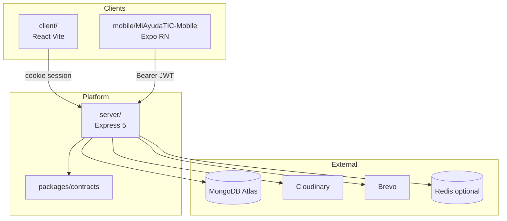

# architecture.md — MiAyudaTIC

> System design memo. **Code wins on conflict** — verify in `archive/audits/` before changing this doc.

---

## System topology



**Prod:** Vercel (web) + Render (API). **Not in workspace:** mobile (separate `pnpm install`).

---

## Bounded contexts

| Domain | Owner module | Core entities |
|--------|--------------|---------------|
| Identity | `server/src/features/auth`, `users` | Usuario, roles, approval |
| Ticketing | `server/src/features/tickets` | Solicitud, SolucionCaso, TipoDeCaso, Consecutivo |
| Catalog | `server/src/features/shared` | Ambiente, Storage |
| Notifications | `server/src/features/shared` | Notificacion + Socket emit |
| Media | `server/src/shared/services/mediaStorage` | Upload, Cloudinary, folders |

**Rule:** No business logic in `server/src/core/` — wiring only.

---

## Frontend web (`client/`)

**Pattern:** FSD-lite — `app → pages → features → shared`

| Layer | Responsibility |
|-------|----------------|
| `app/` | Router, layouts, providers — zero domain logic |
| `pages/` | Route composition |
| `features/` | Domain slices (auth, tickets, users, …) — **no cross-import** |
| `shared/` | API client, types, UI primitives |

**Auth:** Axios `withCredentials`; cookie session; no localStorage JWT.

**Realtime today:** HTTP poll 30s for notifications. **Target:** Socket.IO client (Stage 2).

**Deploy:** `client/vercel.json` SPA rewrite; `VITE_BACKEND_URL` required.

---

## Mobile (`mobile/MiAyudaTIC-Mobile`)

**Official.** Expo 56 + expo-router + SecureStore + Bearer.

| Area | Path | Status |
|------|------|--------|
| Auth | `src/features/auth`, `app/(auth)/*` | Shipped |
| Solicitudes | `src/features/tickets` (planned) | Not started |
| Socket | `src/shared/realtime` (planned) | Not started |

**Líder:** blocked at app layer (`lider-not-supported.tsx`) — web only.

**Legacy:** `mobile_flutter/MBO_ULT` — wrong backend URL — **do not extend**.

---

## Backend / API

**Stack:** Express 5, Mongoose 8, Zod, Socket.IO, Vitest.

**Mount:** All REST under `/api` via `server/src/core/routes.ts`.

**Auth extraction order:** Bearer → cookie → socket `auth.token` (`extractAuthToken.ts`).

**Health:** `GET /api/health` — always HTTP 200; `degraded` if DB disconnected.

**Layers:**

```
index.ts → core/app.ts → features/*/routes → controllers
shared/: middleware, validators, services, config
```

---

## Auth & RBAC

| Mechanism | Web | Mobile |
|-----------|-----|--------|
| Session | httpOnly cookie | Bearer in SecureStore |
| JWT TTL | 7200s | 7200s |
| RBAC | `checkRol([...])` per route | Same API; líder blocked in app |

**Técnico gate:** `estado: true` after líder approval (`accountStatus.ts`).

Detail: `docs/contracts.md` permission matrix.

---

## Notifications

1. **Email** — Brevo templates (solicitud, asignación, cierre, técnico aprobado/denegado).
2. **In-app** — `Notificacion` model + REST.
3. **Socket** — `nuevaNotificacion`, `actualizarSolicitud`, `actualizarTecnico` (`@miayuda/contracts`).

**Room model:** `user:{userId}` on connect.

---

## Offline strategy (target 2026–2027)

| Client | Strategy |
|--------|----------|
| Web | Online-first; optimistic UI only where rollback safe |
| Mobile | **Queue solicitud drafts** in local storage; sync on reconnect; conflict = server wins + user notified |

**Principles:**
- Never delete user draft without explicit action.
- Show sync status badge on mobile.
- Idempotent create via client-generated `draftId` (future API field).

**Not implemented yet** — architecture slot reserved; no hacks before spec in `packages/contracts`.

---

## Sync / conflict principles

1. **Server is source of truth** for ticket state.
2. **Optimistic UI** only for read caches and non-destructive actions.
3. **Concurrent assignment** — líder action wins; técnico sees refresh via socket.
4. **Media** — upload completes before state transition to `finalizado`.

---

## Files & evidence

| Type | Production | Dev fallback |
|------|------------|--------------|
| Fotos solicitud | Cloudinary `evidencias/` | Local `STORAGE_PATH` |
| Perfiles | Cloudinary `perfiles/` | Local |
| Evidencia solución | Cloudinary `evidencias/` | Local |

**Validation:** magic-byte MIME; `MEDIA_MAX_BYTES` cap; HEIC allowed (iOS).

**Model:** `Storage { url, filename }` referenced by Solicitud, SolucionCaso, Usuario.foto.

---

## Analytics events (target instrumentation)

| Event | Actor | Purpose |
|-------|-------|---------|
| `solicitud_created` | funcionario | North-star funnel |
| `solicitud_assigned` | líder | Time-to-first-response |
| `solicitud_resolved` | técnico | Resolution rate |
| `auth_login_success` | all | Activation |
| `mobile_solicitud_created` | funcionario | Mobile share metric |

**Today:** leader charts via API aggregates only. **Stage 2:** client-side analytics SDK or server audit log — decision pending Founder-CTO.

---

## Observability

| Signal | Implementation |
|--------|----------------|
| Liveness | `/api/health` |
| HTTP logs | morgan |
| Socket connections | health.integrations.socket.connections |
| APM | Not deployed — Sentry target |

---

## Security architecture

- Helmet, rate limits (auth, password, upload: 20 req / 15 min)
- CORS whitelist prod; dev localhost regex
- Reset token hashed in DB
- RBAC on every mutating route
- No `lider` self-register
- JWT in httpOnly cookie (web) **and** `Authorization: Bearer` (mobile)
- Socket.IO authenticated via cookie, Bearer, or `auth.token`

### Vulnerability reporting

Report to líder TIC via email: description, reproduction steps, estimated impact. Do not publish in public issues until mitigation is coordinated.

### Secret rotation

| Secret | Where to rotate |
|--------|-----------------|
| `JWT_SECRET` | Render env → redeploy → invalidates active sessions |
| `DB_URI` | MongoDB Atlas → Database Access |
| `BREVO_API_KEY` | Brevo dashboard |

---

## Data handling

| Data | Collection | Access |
|------|------------|--------|
| Nombre, correo, teléfono | `usuarios` | Líder TIC; own user in profile |
| Solicitudes y descripciones | `solicitudes` | Funcionario creator; assigned técnico; líder |
| Evidencias (imágenes) | `storage` + Cloudinary | Same roles as solicitud |
| Notificaciones | `notificaciones` | Recipient only |

**Retention:** solicitudes and users while service is active for the center; application logs ~30 days in production.

**Hosting:** MongoDB Atlas (cluster region as configured). Email via Brevo (EU).

---

## Deployment

**Prod URLs:** Web `https://miayudatics.vercel.app` · API `https://miayudatics-v1-0.onrender.com`

### Render (backend)

| Setting | Value |
|---------|-------|
| Environment | Node |
| Root Directory | *(empty — monorepo root)* |
| Build | `pnpm install --frozen-lockfile --filter nodeproyectosena... && pnpm -C server run build` |
| Start | `pnpm -C server run start` |
| Health Check Path | `/api/health` |

**Key env vars:** `NODE_ENV`, `PORT`, `DB_URI`, `PUBLIC_URL`, `RENDER_URL`, `CLIENT_URL`, `CORS_ORIGINS`, `JWT_SECRET`, `BREVO_API_KEY`, `CLOUDINARY_*`, `MEDIA_MAX_BYTES`, `REDIS_URL` (optional, Socket.IO multi-instance), `REQUIRE_SOLICITUD_FOTO`, `STORAGE_PATH` (fallback if no Cloudinary).

`CLIENT_URL` and `CORS_ORIGINS` must match the Vercel frontend URL. With Cloudinary configured, evidence persists across redeploys; without it, `STORAGE_PATH` is ephemeral on Render free tier.

### Vercel (frontend)

| Setting | Value |
|---------|-------|
| Framework | Vite |
| Root Directory | `client` |
| Build | `pnpm run build` |
| Output | `dist` |
| Install | `pnpm install` |

**Env:** `VITE_BACKEND_URL` (or `VITE_API_URL` with `/api` suffix). SPA rewrites in `client/vercel.json`.

### Socket.IO scaling

- **Single instance:** in-memory rooms; no `REDIS_URL`.
- **Multi-instance:** set `REDIS_URL` → `@socket.io/redis-adapter` activates on boot.

---

## Mobile API integration

**Prod:** API `https://miayudatics-v1-0.onrender.com/api` · Socket `https://miayudatics-v1-0.onrender.com`

| Concern | Pattern |
|---------|---------|
| Auth | `POST /api/auth/login` → store `dataUser.token` in SecureStore |
| Session check | `GET /api/auth/verify-token` with `Authorization: Bearer` |
| Protected routes | `Authorization: Bearer <JWT>` — no cookies |
| Socket | `io(BACKEND_URL, { auth: { token }, transports: ['websocket','polling'] })` |
| Events | `connection:ack`, `actualizarSolicitud`, `actualizarTecnico`, `nuevaNotificacion` |

**Create solicitud (multipart):** `POST /api/solicitud` with `descripcion`, `telefono`, `ambiente`, `tipoCaso`, `usuario`, `foto` (JPEG/PNG/GIF/WebP/HEIC; max `MEDIA_MAX_BYTES`, default 10 MB).

**Decoupled upload:** `POST /api/media/upload?folder=evidencias` → `{ storageId, url }` → `POST /api/solicitud` with `fotoId`.

**Media errors:** 413 `FILE_TOO_LARGE`, 415 `UNSUPPORTED_MEDIA`.

**Reconnect:** exponential backoff after Render cold start (~30–60 s) or JWT expiry (2 h).

---

## Long-horizon rules (2026–2036)

1. **Contracts package grows; clients adopt** — no infinite type duplication.
2. **Mobile stays native Expo** — no Flutter resurrection without full rewrite decision.
3. **Monorepo may absorb mobile** into pnpm workspace when CI ready — not before.
4. **Multi-tenant** requires new bounded context — no `tenantId` sprinkled ad hoc.
5. **BFF layer** only if mobile needs aggregation — prefer thin API + good contracts.
6. **Every new domain** → `server/src/features/<name>/` + Zod + tests + contracts export.

---

## Anti-degradation rules

| Forbidden | Why |
|-----------|-----|
| Business logic in `core/` | Testability |
| Feature importing feature (client) | FSD breach |
| `any` | Type safety |
| Hardcoded mobile API URL | Env drift |
| Public write endpoints without auth | Security |
| Skipping `checkRol` on new routes | RBAC erosion |
| Local-only shortcuts in prod code paths | Ops debt |

---

## References

- Verified audits: `archive/audits/2026-06-13-code-audit/`
- Contracts: `docs/contracts.md`
- Operations runbook: `docs/operating-model.md` (Runbook section)
