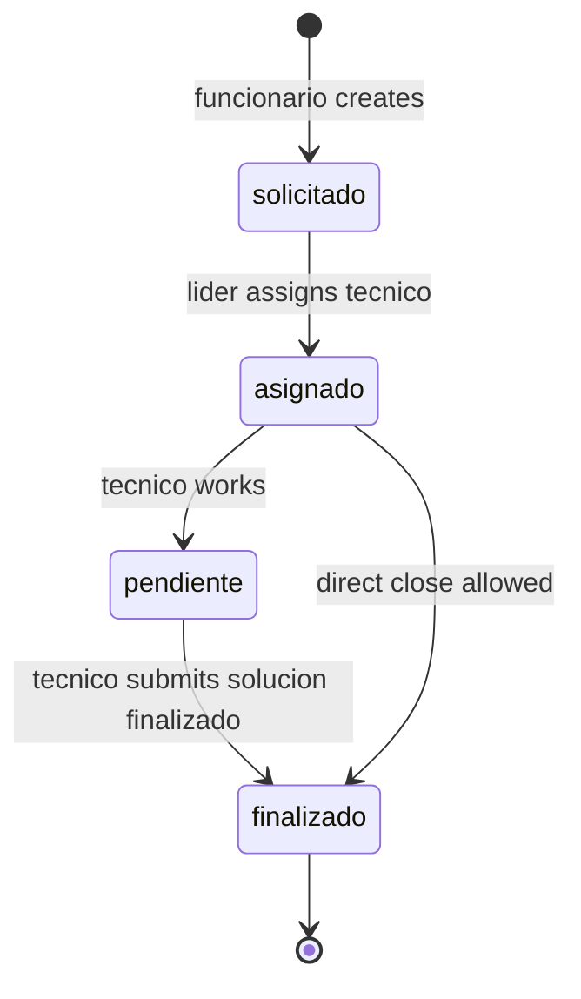

# contracts.md — MiAyudaTIC

> **Single source of truth** for business invariants, permissions, and shared types.  
> Code package: `packages/contracts` (`@miayuda/contracts`). Clients **must converge** here.

---

## Naming conventions

| Layer | Convention | Example |
|-------|------------|---------|
| API paths | camelCase Spanish legacy | `/api/solicitud`, `/solucionCaso` |
| Mongo models | PascalCase | `Solicitud`, `Usuario` |
| Roles | lowercase Spanish | `funcionario`, `tecnico`, `lider` |
| Socket events | camelCase in `RealtimeEvents` | `actualizarSolicitud` |
| Media folders | enum `MediaFolder` | `evidencias`, `perfiles`, `storage` |
| Env vars | SCREAMING_SNAKE | `VITE_BACKEND_URL`, `EXPO_PUBLIC_API_URL` |

---

## Entities (conceptual)

### Usuario

| Field | Invariant |
|-------|-----------|
| `rol` | `funcionario` \| `tecnico` \| `lider` |
| `activo` | false → blocked |
| `estado` | técnico requires `true` after líder approval |
| `correo` | unique |
| Register | only `funcionario` \| `tecnico` — never `lider` |

### Solicitud (ticket)

| Field | Invariant |
|-------|-----------|
| `codigoCaso` | unique per consecutivo rules |
| `estado` | see state machine below |
| `usuario` | creator (funcionario) |
| `tecnico` | set only by líder assign |
| `solucion` | set when técnico closes |

### SolucionCaso

| Field | Invariant |
|-------|-----------|
| `solicitud` | 1:1 active solution per solicitud |
| `tipoSolucion` | `pendiente` \| `finalizado` |
| `evidencia` | optional Storage ref |

### Ambiente, TipoDeCaso, Storage, Notificacion

- **Ambiente:** `activo` flag; líder CRUD.
- **TipoDeCaso:** catalog; líder write; all roles read.
- **Storage:** `{ url, filename }` after upload.
- **Notificacion:** `tipo: estado_ticket`; scoped to `usuario`.

---

## Ticket state machine



**Verified enum in code:** `solicitado | asignado | pendiente | finalizado` (`server/src/features/tickets/models/solicitud.ts`).

**Business rules:**
- Only `funcionario` creates solicitud.
- Only `lider` assigns `tecnico`.
- Only `tecnico` posts `solucionCaso`.
- Delete solicitud: `lider` only.

---

## Permission matrix (API)

| Action | funcionario | tecnico | lider |
|--------|:-----------:|:-------:|:-----:|
| POST /solicitud | ✓ | — | — |
| GET own historial | ✓ | — | — |
| GET /solicitud/pendientes | — | — | ✓ |
| GET /solicitud/asignadas | — | ✓ | — |
| POST /solucionCaso/:id | — | ✓ | — |
| PUT asignarTecnico | — | — | ✓ |
| /tecnicos/* approve | — | — | ✓ |
| /tipoCaso POST/PUT/DELETE | — | — | ✓ |
| /ambienteFormacion write | — | — | ✓ |
| GET /usuarios/perfil | ✓ | ✓ | ✓ |
| POST /media/upload | ✓ | ✓ | ✓ |
| Mobile app login | ✓ | ✓ | **blocked** |

---

## Auth contract

| Transport | Header / storage | TTL |
|-----------|------------------|-----|
| Web | httpOnly cookie `token` | 7200s |
| Mobile | `Authorization: Bearer` + SecureStore | 7200s |
| Socket | `auth.token` or Bearer | connection-bound |

**Verify:** `GET /api/auth/verify-token`  
**Logout:** `POST /api/auth/logout` + clear client storage

---

## Payload contracts (Zod — `packages/contracts`)

### Solicitud create fields

```typescript
// packages/contracts/src/solicitud.ts
ambiente: ObjectId string
tipoCaso: ObjectId string
descripcion: min 10 chars
telefono: min 1
usuario: ObjectId string
fotoId?: ObjectId string
```

### Solución fields

```typescript
descripcionSolucion: min 5
tipoCaso: ObjectId string
tipoSolucion: 'pendiente' | 'finalizado'
```

### Media upload response

See `packages/contracts/src/media.ts` — `MediaUploadResponse`, `MediaFolder`.

---

## Socket events (`packages/contracts/src/socket.ts`)

| Event | Payload summary |
|-------|-----------------|
| `connection:ack` | userId, serverTime |
| `actualizarSolicitud` | solicitudId, estado, … |
| `actualizarTecnico` | tecnicoId, numeroSolicitudesAsignadas |
| `nuevaNotificacion` | full notification document |

**Client obligation:** subscribe after auth; handle reconnect with backoff.

---

## Expected errors (API)

| Code | Meaning | Client behavior |
|------|---------|-----------------|
| 401 | No/invalid token | Redirect login |
| 403 | Wrong role or pending técnico | Role-specific message |
| 422 | Zod validation | Inline field errors |
| 429 | Rate limit | Retry after delay |
| 500 | Server error | Toast + support ref; no leak stack |

**Security:** `recuperarPassword` — same response whether email exists or not.

---

## Adoption status (honest)

| Consumer | Uses `@miayuda/contracts` |
|----------|---------------------------|
| server | **Yes** |
| client | **No** — local `domain.ts` (debt) |
| mobile Expo | **No** — local Zod (debt) |

**Rule for new work:** extend `packages/contracts` first, then import in server; client/mobile follow in same PR or immediate follow-up.

---

## Invariants (never violate)

1. Server validates every write — client checks are UX only.
2. Técnico cannot login until líder approves.
3. Líder cannot self-register via public API.
4. Ticket state transitions only through defined controllers.
5. Media URLs must come from Storage model or Cloudinary — no arbitrary external URLs in DB.
6. JWT payload contains only `{ _id, rol }` — no PII in token.

---

## References

- Package source: `packages/contracts/src/`
- Route evidence: `archive/audits/2026-06-13-code-audit/backend-audit.md`
- Architecture: `docs/architecture.md`
