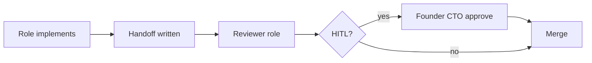

# operating-model.md — MiAyudaTIC

> How the Founder coordinates a 6-role hybrid team using Cursor as runtime.

---

## You are the coordinator

You do not "chat with AI." You **operate a system**:

1. Pick a **workstream** (one outcome, one primary role).
2. Open a **dedicated chat** (or agent) with role + mission in the first message.
3. Attach **only** the context files that role needs (`docs/*.md` + relevant `archive/audits/` slice).
4. Receive a **handoff** when done; you merge or reassign.
5. **Human review** on HITL — you are the final signatory.

---

## Chat separation rules

| Do | Don't |
|----|-------|
| One role per chat for implementation | Mix Design + PE2 in same thread without clear phase boundary |
| New chat per workstream | Infinite thread with 20 unrelated tasks |
| Paste handoff template at start | Assume agent remembers last week |
| Reference file paths explicitly | Say "fix the app" |

**Naming convention:** `[Role] — [Outcome]` e.g. `Mobile Eng — Solicitud create v1`

---

## Foreground vs background

| Mode | Use when |
|------|----------|
| **Foreground** (interactive chat) | UX decisions, ambiguous requirements, HITL approval, debugging, review |
| **Background** (agent/task) | Audits, test runs, smoke scripts, doc generation, repo-wide search |

**Rule:** Never background HITL changes (auth, schema, deploy).

---

## Task chunking

A workstream fits **one session** if:

- ≤ 5 files touched (guideline, not law)
- One acceptance criteria block in handoff
- One primary role owner

**Too big?** Split:

```
PE2: contracts + API endpoint
  → handoff →
PE1: web integration
  → handoff →
Design: polish states
```

---

## Priority framework

| P0 | Prod down, security breach, data loss |
| P1 | Blocks pilot / release smoke fail |
| P2 | Stage 1 roadmap item (mobile solicitud) |
| P3 | Polish, debt, docs |

**Founder-CTO** assigns P0/P1. Role owners propose ordering within P2/P3.

---

## Review & merge



| Step | Owner |
|------|-------|
| Self-check quality-bar | Implementing role |
| Code review | Matrix in `agents.md` |
| HITL approval | Founder-CTO (you) |
| Prod smoke | AI Ops or you post-merge |

**No direct push to main** without review + green CI.

---

## Context hygiene

| Principle | Action |
|-----------|--------|
| Canonical docs | `docs/` — single source of truth |
| Code truth | `archive/audits/` when docs conflict |
| Legacy | `archive/audits/context-legacy/` — read-only reference |
| Historical QA | `archive/qa/` — past sign-offs |

**Weekly (15 min):** AI Ops role scans doc drift; one fix or ticket.

---

## Parallel execution pattern

**Example: Mobile Stage 1 kickoff**

| Chat | Role | Deliverable |
|------|------|-------------|
| A | PE2 | `packages/contracts` + POST solicitud mobile fields if needed |
| B | Mobile Eng | Expo solicitud screen (after A merges or using mocked API) |
| C | Design Eng | Loading/error/empty states spec |

**Sync point:** Contracts merged → unblocks B.

Use Cursor **multiple chats** or **Task tool** for read-only explore — not for conflicting writes.

---

## Velocity without chaos

| Lever | Guardrail |
|-------|-----------|
| Tiny PRs | Handoff per PR |
| Contracts first | No duplicate types |
| Smoke gates | No Friday prod deploy without sign-off |
| Feature flags | Not implemented yet — use env + pilot users instead |
| AI multiplication | AI Ops improves CI/docs; does not ship unreviewed product code |

---

## What failure looks like

- Agent edits auth without HITL
- Mobile chat edits `server/` without PE2
- 3 weeks no handoff artifacts
- Flutter legacy resurrected
- `docs/` ignored; agent reads obsolete scattered files

**Recovery:** Stop workstream → Founder-CTO reset with handoff template → narrow scope.

---

## Runbook

### Health check

```bash
curl https://miayudatics-v1-0.onrender.com/api/health
```

Expected: HTTP 200 with `"status": "ok"` or `"degraded"` if DB disconnected. Render **Health Check Path:** `/api/health`.

Post-deploy smoke:

```bash
./scripts/smoke-prod.sh
# or: pnpm run smoke:prod
```

QA checklist (historical): `archive/qa/production-qa-checklist.md`

### Deploy flow

1. Merge to `master` → CI green
2. Vercel auto-deploy (`client/`)
3. Render auto-deploy (`server/`)
4. Run `pnpm run smoke:prod` or GitHub Actions **Post-Deploy Smoke**

### Socket.IO incidents

- Handshake 401: missing/expired token (2 h) or inactive user → re-login
- Cold start disconnects sockets → client reconnect with backoff
- Multi-instance: requires `REDIS_URL` (see `docs/architecture.md`)

### Upload errors (mobile)

| HTTP | Code | Action |
|------|------|--------|
| 413 | `FILE_TOO_LARGE` | Reduce image or raise `MEDIA_MAX_BYTES` |
| 415 | `UNSUPPORTED_MEDIA` | Use JPEG/PNG/WebP/HEIC; validate magic bytes |

### Cold start (Render free tier)

After ~15 min idle, backend may take 30–60 s. Frontend should show recoverable connection error.

### Rollback

- **Vercel:** Deployments → Promote previous deployment
- **Render:** Manual Deploy → previous commit

### MongoDB Atlas down

- Check Atlas status; verify `DB_URI` and IP allowlist
- `/api/health` returns `"status": "degraded"`, `"database": "disconnected"` (still HTTP 200)

### Brevo failure

App flows continue; emails logged. Verify `BREVO_API_KEY`; disable "Block unknown IP addresses" in Brevo.

### Backup

- MongoDB Atlas: continuous backups on production cluster
- Evidence: Cloudinary (`CLOUDINARY_*` in Render) — not on Render disk
- Local `STORAGE_PATH` only when Cloudinary is not configured

---

## References

- Roles: `docs/agents.md`
- Cadence: `docs/execution-rhythm.md`
- Handoff: `docs/handoff-template.md`
