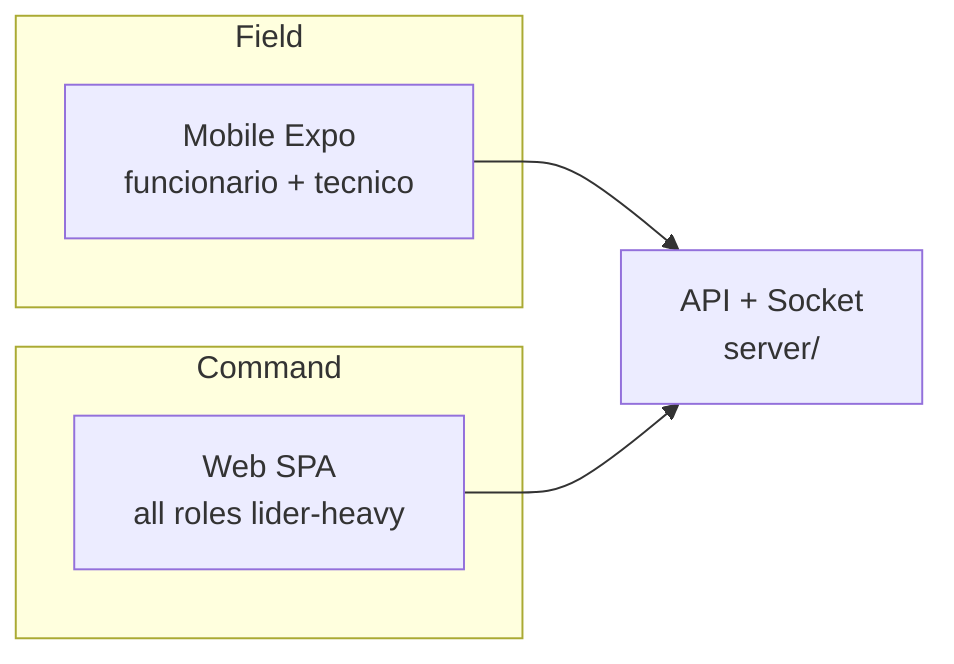

# product.md — MiAyudaTIC

> Founder memo. Source of truth for **what we build and why**.  
> Verified product facts live in `archive/audits/`; this doc defines **direction**.

---

## Problem (real)

Centros de formación SENA operan soporte técnico con canales fragmentados: WhatsApp, papel, memoria oral. Resultado:

- Incidencias sin trazabilidad ni código de caso.
- Técnicos sin cola clara ni evidencia de cierre.
- Líderes TIC sin métricas ni control de aprobación de personal.
- Funcionarios en campo sin herramienta rápida para reportar con foto.

**MiAyudaTIC** convierte ese caos en un sistema con roles, estados, evidencia y métricas — no un chat genérico.

---

## ICP / Users

| Persona | Rol sistema | Contexto de uso |
|---------|-------------|-----------------|
| Funcionario de formación | `funcionario` | Ambiente de clase; reporta fallo con foto |
| Técnico de soporte | `tecnico` | Campo o mesa; resuelve casos asignados |
| Líder TIC / coordinador | `lider` | Desktop; asigna, aprueba técnicos, administra catálogos |

**ICP institucional:** CTPI y centros SENA que necesitan mesa de ayuda **propia**, no Zendesk genérico.

**Not ICP:** SaaS multi-tenant B2B, ITSM enterprise, helpdesk externo sin roles institucionales.

---

## Jobs to be done

| Rol | Core JTBD |
|-----|-----------|
| Funcionario | "Reportar un problema técnico en mi ambiente con evidencia y saber que alguien lo atenderá." |
| Técnico | "Ver mis casos asignados, resolver con evidencia y cerrar con trazabilidad." |
| Líder | "Operar la mesa: asignar, aprobar técnicos, medir carga por ambiente y mes." |

---

## Wedge inicial

1. **Web production-ready** — tres roles, flujo solicitud → asignación → solución → cierre.
2. **API mobile-ready** — Bearer JWT, Socket.IO, multipart (Phase 4 backend done).
3. **Mobile Expo auth** — onboarding campo; **next wedge:** funcionario crea solicitud desde teléfono.

**Wedge = velocidad de reporte en ambiente + trazabilidad para el líder.** No features de ITSM enterprise.

---

## Why MiAyudaTIC matters

- **Institutional fit:** roles y flujos alineados al SENA, no configuración infinita.
- **Ownership:** producto interno de altísima calidad, no contrato SaaS caro.
- **Field + command:** móvil para quien reporta/atiende; web para quien opera la mesa.
- **10-year base:** monorepo, contratos compartidos, RBAC explícito — diseñado para evolucionar sin reescritura.

---

## Vision: web + mobile

| Surface | Owner experience | Status |
|---------|------------------|--------|
| Web | Premium admin + full workflows | **Shipped** |
| Mobile Expo | Native field: report + resolve | **Auth shipped; core v2** |
| Flutter legacy | Reference only | **Do not ship** |

**Mobile is not a responsive afterthought.** Líder opera en web; funcionario y técnico merecen experiencia nativa (cámara, offline queue, push).

---

## What "premium" means here

| Dimension | Premium bar |
|-----------|-------------|
| Visual | SENA institutional (`#04324d`, `#39a900`), zero clutter, clear hierarchy |
| Interaction | Inline validation; no modal mazes; loading states everywhere |
| Trust | Código de caso visible; estado siempre claro; emails transaccionales |
| Speed | Perceived instant UI; cold start mitigated; optimistic where safe |
| Field | Photo capture < 3 taps; works on mid-range Android |

**Anti-premium:** generic admin tables, spinner deserts, English error strings, broken assets, "Módulo en construcción" sin fecha.

---

## What "world-class" means

**Web:** FSD discipline, role-native IA, charts for líder, zero orphan routes, cookie auth done right.

**Mobile:** expo-router, SecureStore, Bearer auth, offline-first solicitud draft (v2), push on assignment (v2), 60fps lists, no WebView hacks.

**Platform:** RBAC on every route, Zod at boundary, `@miayuda/contracts` as north star, health always 200, smoke gates prod.

---

## Internal adoption strategy

1. **Week 0:** Seed líder; 2 técnicos aprobados; ambientes y tipos de caso cargados.
2. **Week 1:** 5 funcionarios piloto crean solicitudes reales (web).
3. **Week 2:** Técnicos cierran 80% en SLA piloto; líder usa estadísticas.
4. **Week 3+:** Mobile funcionario beta; medir % solicitudes desde móvil vs web.

**Champion:** Líder TIC. Sin líder activo, el producto muere.

---

## North-star metrics

| Metric | Definition | Target (pilot) |
|--------|------------|----------------|
| Time-to-first-response | Solicitud creada → asignada | < 4h laborables |
| Resolution rate | Finalizados / creados (30d) | > 85% |
| Mobile report share | Solicitudes desde Expo / total | > 40% (post v2) |
| Technician activation | Técnicos aprobados con ≥1 cierre / aprobados | > 90% |
| Leader weekly active | Líder login + ≥1 acción admin / semana | 100% pilot |

**Guardrail:** 0 P0 security regressions; smoke prod 12/12 before any release.

---

## Roadmap by stage

### Stage 0 — Now (verified shipped)
- Web: full role journeys
- API: prod on Render; Vercel frontend
- Mobile: auth only (`mobile/MiAyudaTIC-Mobile`)

### Stage 1 — Mobile core (next)
- Funcionario: create solicitud + photo (Expo)
- Técnico: assigned list + solution + evidence
- Socket client for notifications

### Stage 2 — Platform hardening
- Client + mobile adopt `@miayuda/contracts`
- CI: mobile typecheck + smoke:mobile-api
- Sentry / error tracking

### Stage 3 — Field excellence
- Offline solicitud queue + sync
- Push notifications (assignment, closure)
- EAS build + internal distribution

### Stage 4 — Scale (2028+)
- Multi-centro (if institution expands) — **only with explicit architecture spec**
- Analytics pipeline; SLA dashboards export

---

## Anti-goals (what we are NOT)

- Generic ticket SaaS for arbitrary companies
- Low-code workflow builder for líderes
- Flutter `mobile_flutter/MBO_ULT` (legacy, wrong backend)
- Líder admin on mobile (by design — web command center)
- Feature factory without metrics or adoption proof
- AI chatbot as product surface (AI is **internal ops leverage** only)

---

## References

- Verified code map: `archive/audits/2026-06-13-code-audit/repo-map.md`, `archive/audits/2026-06-13-code-audit/mobile-audit.md`
- Legacy context (archived): `archive/audits/context-legacy/`
- Contracts: `docs/contracts.md`
- Architecture: `docs/architecture.md`
